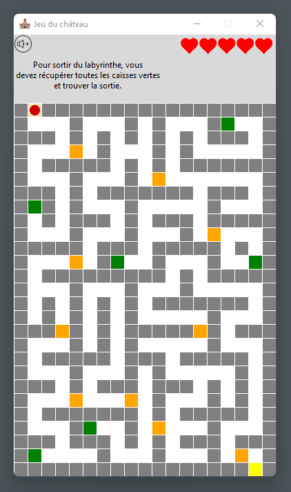

Author: Daezana  
Name: Castle Game  
Date: June 28, 2022  
Description: Game of the escape game type in which the player controls the movements of a character using the keyboard.

# Python Escape game 

This project was realised from an idea of a project of a MOOC (Massive Open Online Course).  
MOOC: Apprendre à coder avec Python.  
Website: [Fun MOOC](https://www.fun-mooc.fr).  

The player controls a character represented by a red dot, using the keyboard.  
He must find the exit of the maze after collecting all the objects represented by a green square.  
On his way, the player must correctly answer the questions asked by gards. The answer can be written in upper or lower case but accents must be respected.  
The player starts with 5 lives.  
If the player finishes the game, a pop-up windows appears to ask him if he wants to
restart a game. If he answers no, the program closes.  

Python requires: >= 3.6

---
## Initial project presensation, MOOC 'Apprendre à coder avec Python':
**'Quête dans le sommet du Python des neiges.'**

Game of the escape game type in which the player controls the movements of a character
using the keyboard within a castle represented in plan.  
The player must collect all the objects hidden in the castle that will help him find the
answers to be able to open a door.  
A door can only be crossed by correctly answering a question.  
The goal of the game is to reach the exit.  

The program will use the turtle module as a graphical interface.
It'll have two main parts:
- the drawing of the plan of the castle;
- the management of the game on the plotted plan: character's movements within the castle,
display of the objects collected, management of the opening doors.  

The necessary data: plan of the castle, objects and doors are encoded in 3 text files.

---
## Differences with the initial project:

The program uses as main module the tkinter module and not the turtle module.  
There is no inventory of items picked up and these do not give clues to answer questions.  
The program uses the pygame module to manage music in the background of the game,
which can be paused if the user wishes by pressing the sound icon.  

---

### Credits:  

**Images:**  
[Pixabay](https://pixabay.com/)  
* Castle icon: OpenClipart-Vectors  
* Heart : Clker-Free-Vector-Images  
* Sound Lower: raphaelsilva, Raphael Silva  
* Sound Higher: raphaelsilva, Raphael Silva  

**Sound:**  
* Author: Kevin Macleod; Title: Voxel Revolution; Site web: [Incompetech](https://incompetech.com/wordpress/).

---